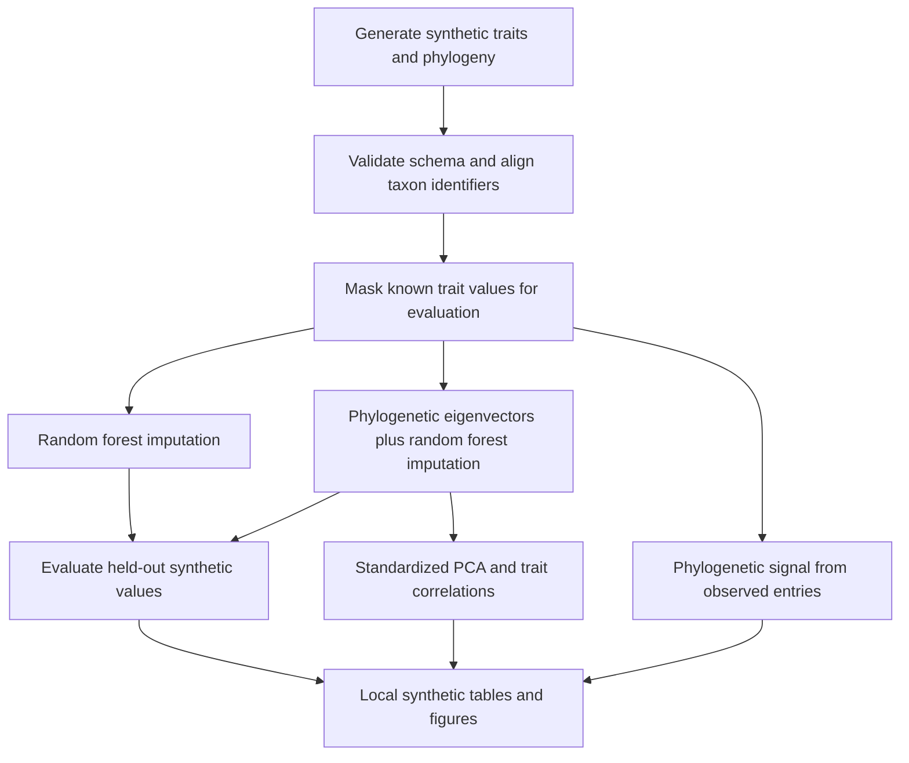

# Coral trait phylogenetics

Research software for exploring missing trait data and phylogenetic signal in a coral trait analysis workflow.

This repository presents the computational methods supporting a research project whose empirical data and findings are withheld for publication. The executable example uses **entirely synthetic traits and a newly simulated tree**. Its anonymous tip labels, topology, branch lengths, and numerical outputs have no mapping to the study's species or results.

## Workflow



The workflow demonstrates data validation, tree matching, missing-data evaluation, phylogenetic predictors, Pagel's lambda, Blomberg's K, binary D, and multivariate exploration. See [methods and assumptions](docs/METHODS.md) for the scope of each step.

## Run locally

Install R 4.4 or later, then run these commands from the repository root:

```sh
Rscript scripts/install_dependencies.R
Rscript tests/test_pipeline.R
Rscript scripts/run_workflow.R
```

Generated files are written to `artifacts/`, which is excluded from Git. Figures are explicitly labelled synthetic. The script accepts no empirical input files: the distributed entry point generates its own example internally.

The dependency installer uses CRAN. Exact installed versions are recorded by the workflow so that a run can be inspected; this release does not include a complete transitive dependency lockfile. Random seeds make the example reproducible within a compatible software environment, but package changes can affect numerical output.

## Repository guide

| Location | Purpose |
| --- | --- |
| `R/` | Analysis functions and synthetic fixture generation |
| `scripts/run_workflow.R` | End-to-end research methods example |
| `tests/test_pipeline.R` | Validation and analysis behaviour checks |
| `docs/METHODS.md` | Methods, assumptions, and interpretation limits |
| `docs/DATA_POLICY.md` | Publication boundaries and release review |
| `.github/workflows/validate.yml` | Automated release checks and R validation |
| `release-files.txt` | Explicit list of files eligible for publication |

## Validation and publication scope

GitHub Actions checks the publication allowlist, runs the tests, and executes the complete synthetic workflow. It does not publish generated analysis artifacts.

Successful execution validates this distributed workflow. It does **not** establish that every historical research script runs unchanged, reproduce the withheld manuscript results, or validate biological conclusions. This is a newly organized implementation of the methods, with transparent runnable examples.

Only software and methods documentation are published. No original manuscript, research table, saved R session, empirical tree, species key, institutional details, or private review records are included. Read the [data policy](docs/DATA_POLICY.md) before adding files.
