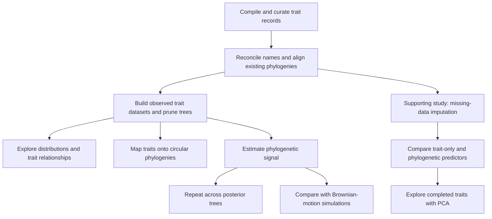

# Coral trait phylogenetics

**Trait ecology · Evolutionary relationships · Comparative analysis in R**

How are coral traits distributed across evolutionary history? This research brings together trait compilation, taxonomic reconciliation, phylogenetic signal analysis, simulation, missing-data assessment, and scientific visualization.

<p align="center">
  
</p>

*Trait mapping on a circular phylogeny. Independently simulated illustration; topology, branch lengths, and colours are generated by the included code.*

## Research workflow

The main analysis follows observed trait records through preparation, exploration, and comparative analysis. Related studies examine missing-data methods and multivariate trait space.



| Research stage | Work involved |
| --- | --- |
| **Compile and curate** | Combine trait records, harmonize units and categorical labels, summarize repeated observations, and resolve duplicated records. |
| **Align traits and trees** | Reconcile taxonomic names with existing phylogenies, match records to tree tips, and construct trait-specific datasets and pruned trees. |
| **Explore observations** | Inspect distributions and missingness; examine relationships among continuous and categorical traits using available observations. |
| **Visualize evolutionary context** | Produce circular phylogenies with mapped trait values and mixed-variable plot matrices. |
| **Quantify phylogenetic signal** | Estimate Pagel's λ and Blomberg's K for numeric traits and Fritz–Purvis' D for two-state traits, with explicit attention to trait coding. |
| **Examine tree uncertainty** | Repeat signal analyses across posterior phylogenies and summarize variation among estimates. |
| **Evaluate metric behaviour** | Simulate trait evolution under Brownian motion and compare the behaviour of λ and K with this reference model. |

## Exploring traits together

<p align="center">
  
</p>

*Simulated illustration of mixed-trait exploration. The panels demonstrate distributions, point plots, boxplots, and category counts; association panels identify the analytical operation.*

This view brings different trait types into one inspection step. It helps identify variation, examine possible associations, and decide which comparisons and encodings suit each trait. The research's observed-data analyses retain available observations for each comparison.

## Supporting analyses

| Analysis | Purpose and methods |
| --- | --- |
| **Missing-data imputation** | Compare random-forest imputation using traits alone with models that also include predictors derived from phylogenetic structure. |
| **Imputation assessment** | Examine the sensitivity of downstream analyses to completed trait tables. The public example additionally masks known simulated values to evaluate prediction error. |
| **Multivariate trait space** | Use centred and scaled PCA to explore completed continuous-trait tables and visualize variation across several traits. |
| **Sensitivity to analytical choices** | Investigate alternative phylogenies, trait encodings, and the categorical signal metric Delta in related analyses. |
| **Geographic assemblages — earlier exploration** | Organize species assemblages by geographic units and explore phylogenetic diversity. |

The workflow diagram and tables describe the broader research. The executable example below implements a focused selection of these methods; [implementation coverage and assumptions](docs/METHODS.md) distinguish the runnable components from the wider research work.

## Run the public workflow

The R example generates its own synthetic inputs and runs identifier validation, tree alignment, masked-value imputation assessment, phylogenetic predictors, observed-entry λ/K/D estimation, PCA, and correlations.

Install R 4.4 or later, then run from the repository root:

```sh
Rscript scripts/install_dependencies.R
Rscript tests/test_pipeline.R
Rscript scripts/run_workflow.R
Rscript scripts/export_methods.R
```

Outputs are written to ignored `artifacts/`. The final command recreates the two illustrations displayed above. [Figure notes](docs/workflow-outputs.md) document their generation and the additional synthetic imputation and PCA gallery.

GitHub Actions runs the publication checks, analysis tests, complete synthetic workflow, and methods illustration exporter. Fixed seeds and recorded software versions support repeatable runs within a compatible environment; a complete dependency lockfile is not included.

## Code and documentation

| Location | Contents |
| --- | --- |
| [R/workflow.R](R/workflow.R) | Synthetic inputs, validation, imputation, signal estimation, and multivariate analysis |
| [scripts/run_workflow.R](scripts/run_workflow.R) | End-to-end executable example |
| [scripts/export_methods.R](scripts/export_methods.R) | Circular trait map and mixed-variable matrix generation |
| [tests/test_pipeline.R](tests/test_pipeline.R) | Analysis behaviour and validation checks |
| [Methods](docs/METHODS.md) | Research context, implementation coverage, and assumptions |
| [Figure notes](docs/workflow-outputs.md) | Illustration provenance and reproduction commands |
| [Data policy](docs/DATA_POLICY.md) | Publication boundaries and review process |

This repository shares code, methods, and simulated illustrations. Research data, species mappings, empirical figures, and manuscript findings remain outside the release. The public workflow demonstrates execution of the distributed methods; it does not reproduce the manuscript analysis.

[Browse the accompanying methods website](https://superamazingmatt.github.io/coral-trait-phylogenetics/) · [Automated validation](https://github.com/SuperAmazingMatt/coral-trait-phylogenetics/actions)
