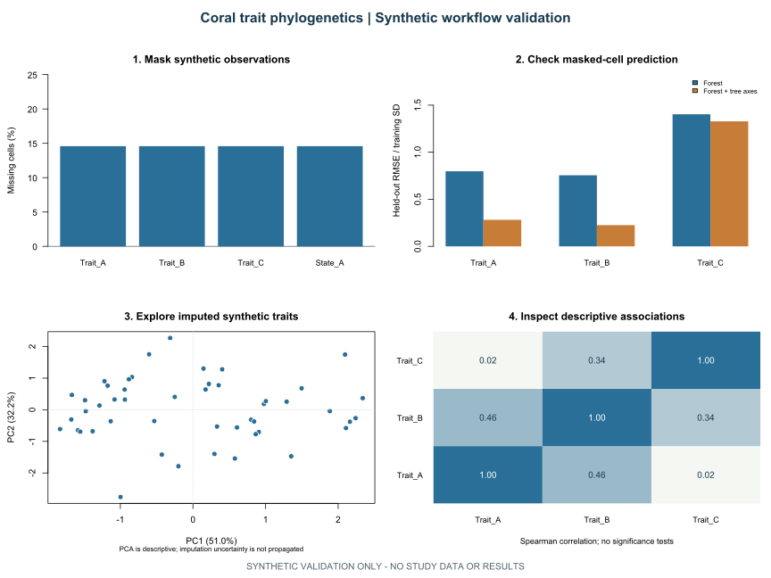
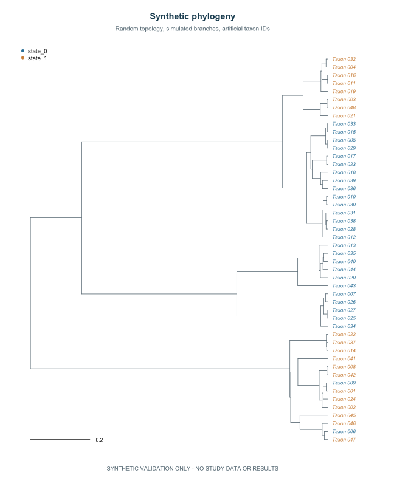

# Selected workflow outputs

[Project overview](../README.md) · [Methods and assumptions](METHODS.md) · [Data policy](DATA_POLICY.md)

These figures illustrate the computational workflow for trait imputation, phylogenetic analysis, and multivariate exploration. **Every displayed value, taxon identifier, tree branch, and branching pattern is synthetic.** The empirical research data and findings remain withheld for publication.

The figures come from the executable code in this repository. They demonstrate how the methods operate and how outputs can be presented; they do not represent biological conclusions from the study.

## From missing values to multivariate exploration



*Figure 1. Synthetic workflow outputs. The two imputation fits share the same masked cells. PCA and correlations use the completed synthetic table from the fit with tree predictors.*

| Panel | What the workflow does | What to look for |
| --- | --- | --- |
| **1. Mask observations** | Hides known synthetic trait values while retaining their original values for evaluation. | Missingness is controlled so predictions can be checked against known values. |
| **2. Check prediction** | Compares random forest imputation with and without tree-derived predictors. | Shorter bars indicate lower held-out error for this example. One random mask does not establish that either method is better in research data. |
| **3. Explore traits** | Runs centred, scaled PCA on the imputed continuous traits. | Each point is an artificial taxon; axes summarize variation within this synthetic table. PCA does not adjust for phylogeny or propagate imputation uncertainty. |
| **4. Inspect associations** | Summarizes pairwise Spearman correlations. | Colours and values describe synthetic associations. No significance tests or biological claims are made. |

The code also estimates continuous lambda/K and binary D using **observed entries only**, separately from the imputed-table exploration. Those synthetic numerical summaries are generated locally; the gallery focuses on the visual workflow. See [phylogenetic signal methods](METHODS.md#phylogenetic-signal).

## A simulated phylogeny with anonymous tips



*Figure 2. Entirely synthetic phylogeny. Tip colours represent two artificial states; the scale refers to simulated branch lengths after normalization to unit tree height.*

This figure demonstrates tree rendering, matching tip identifiers to traits, and mapping categorical states to colours. The tree is generated with `ape::rcoal`; the fixture contains 48 artificial taxa, chosen only to keep the example compact. The `Taxon_` identifiers have no lookup key or connection to real species.

Removing tip labels from an empirical tree would still disclose its topology and branch lengths. This illustration instead uses a newly simulated tree, allowing the full visual output to be shown without disclosing the empirical structure.

## Reproduce the gallery

From the repository root, install the dependencies and run the exporter:

```sh
Rscript scripts/install_dependencies.R
Rscript scripts/export_gallery.R
```

The exporter runs the complete synthetic workflow, leaves its tables and run records under ignored `artifacts/synthetic-validation/`, and refreshes only the two SVG illustrations in `docs/figures/`. It adds accessible titles and synthetic provenance descriptions; it does not load an empirical input file. Review changes to the illustrations before committing them.

The committed illustrations were generated with R 4.4.0, ape 5.8, phytools 2.3.0, missForest 1.5, and caper 1.0.3. Seeds are fixed in the workflow: fixture 2718, masking 2719, imputation 2720, and signal 2721. The source code specifies all example settings. `package_versions.csv` and `PROVENANCE.txt` in the local output directory record each new run. Package versions, fonts, and graphics devices can change numerical output or SVG rendering, so regenerated files need not be byte-identical across environments.

Read the [methods and assumptions](METHODS.md) for the limits of these examples and the [data policy](DATA_POLICY.md) for the publication boundary.
